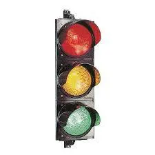

# Lite information om projectet

Detta är en kort beskrivning av trafiksystem projektet.

## Funktioner

- Mutex
- Threads
 - Thread.join

## Använd programmet såhär

1. Starta programmet.
2. Se hur trafikljussystemet beter sig i realtid.
3. Testa tvinga fram rödljus med P.
4. Avsluta programmet med Q.

## En bild som representerar ett trafikljus.

### En länk

[Länk till github repon är ] (https://github.com/flaxdrop/Projekt2)